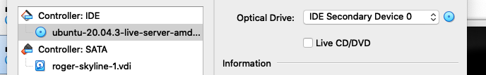

# Creating the Virtual Machine
Assuming we have [VirtualBox](https://www.virtualbox.org/) installed in our system, to create a virtual machine, we just have to launch it, and proceed with the following instructions.

## New Virtual Machine
There are several ways to create a virtual machine. From the main program's interface we can click on **new** and continue from there:


> We can also access this option from the application's **toolbar**, under ``Machine > New...``.

Then we have to **name** it, and choose the **operating system** we plan to install in our guest system (the virtual machine).


> We gotta press **continue** when we're done ;-)

We can achieve what we just did above, using the command line:
```
VBoxManage createvm --name roger-skyline-1 --register
VBoxManage modifyvm roger-skyline-1  --ostype Linux_64

```

## Memory Size
Next we have to decide how much of the available RAM in our **host system** (my **real** macBook air), we want to allow the virtual machine to use. Since I have available **8 gigabytes**, I decided to make available approximately half of it (around 4 GB):


We can do that from the command line as well:
```
VBoxManage modifyvm roger-skyline-1 --memory 4024
```

## Hard Disk
Next we have to take care of the **virtual hard disk**. In this case we have three options, but we'll go with the **default**, and create the disk now.


And also the **type** of disk we want; we'll go again with the **default**, known as **VirtualBox Disk Image**:


The virtual hard disk file can be configured to grow **dynamically**, or to stay **static**, with no room for growth. Again we'll chose the **default**, static:



Using the command line we can achieve the same results with a few lines:
```
VBoxManage createhd --filename /location/roger-skyline-1.vdi --size 8000 -variant fixed
VBoxManage storagectl roger-skyline-1 --name "SATA Controller" --add sata --controller IntelAHCI
VBoxManage storageattach roger-skyline-1 --storagectl "SATA Controller" --port 0 --device 0 --type hdd --medium /path/to/file/roger-skyline-1.vdi
```
In this case, using the command-line requires us to set up the **storage controller**, as well as **attaching it** to our machine.

> All these **commands** can be consulted on the **online** [User Manual](https://www.virtualbox.org/manual/UserManual.html)

---
[:arrow_backward:][back] ║ [:house:][home] ║ [:arrow_forward:][next]

<!-- navigation -->
[home]: ../README.md
[back]: ../README.md
[next]: ./installing_ubuntu_server.md
