# Installing Ubuntu Server
To install [Ubuntu Server](https://ubuntu.com/download/server), we just have to go to visit its official website and click on the [manual server installation](https://ubuntu.com/download/server) link. That should take us to a page where we can download **installer**, which is an [ISO file](https://en.wikipedia.org/wiki/Optical_disc_image).

> At the time of writing this, that file was named `ubuntu-20.04.3-live-server-amd64.iso`.

Once we have downloaded the ISO image to our hard drive, we have to mount it into our **virtual machine** (think of it as inserting an installation CD into an imaginary computer). To do so we just have to click on **settings**:

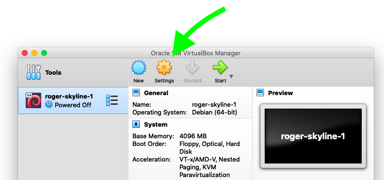

Then click on the **storage** tab:

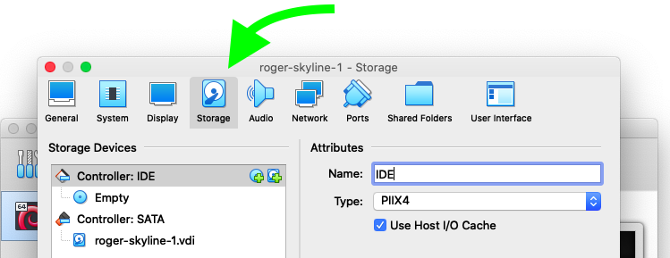

Then select the available **IDE controller** (empty for now), and then click all the way to the right on the CD icon. That'll pop up a dialog box where we can select the location of the **network installer** wherever we downloaded it.

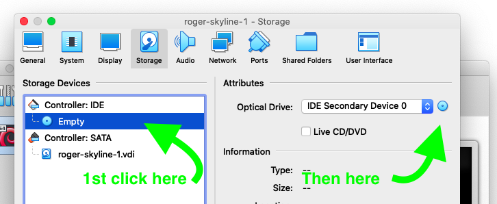

We can confirm that the ISO image was properly inserted, we ccan proceed to boot up the virtual machine (next section).

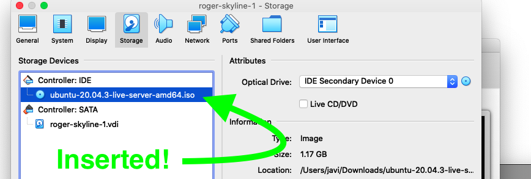

> Read below if you like to achieve the same using commands.

We could have achieved the same results with the command line:
```
VBoxManage storageattach roger-skyline-1 --storagectl "IDE Controller" --port 1 --device 0 --type dvddrive --medium "/path/to/file/ubuntu-20.04.3-live-server-amd64.iso"
VBoxManage modifyvm roger-skyline-1 --boot1 dvd --boot2 disk --boot3 none --boot4 none
```

Using the command line, note how in the last line we also had to set up the **booting order**.

## Installation
Once the ISO file is *inserted*, we just have to start up the machine:

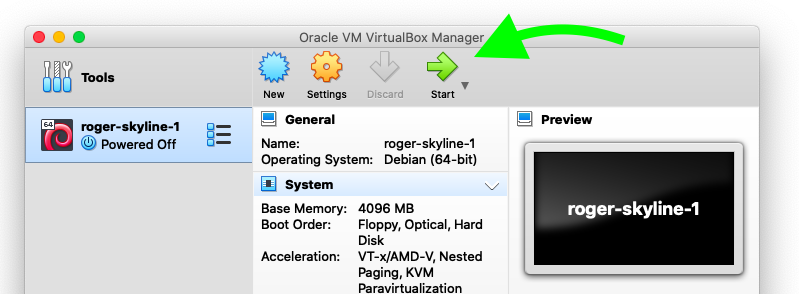

### Language
Next we're faced with the first step of the installation, choosing our **language**:


### Keyboard
Then the **keyboard layout**, where we can also select layout variants.


### Network Interface
Time to configure the network interface. We'll go with the defaults in this case:

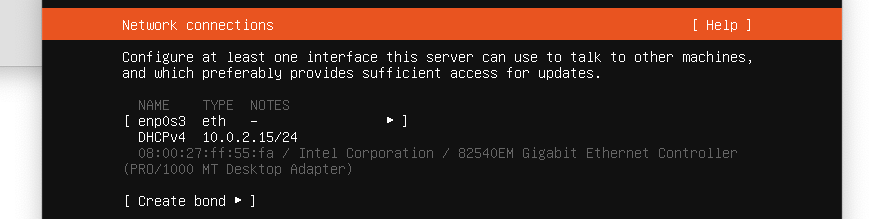

### Proxy Configuration
In case we have a **proxy** now we should enter its information:

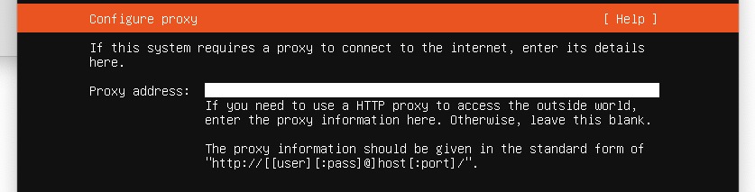

### Archive Mirror
The server from where we want to download packages from. The **default** one looks close enough:

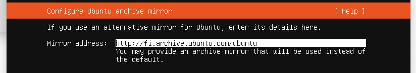

### Disk Partitioning
This part of the installation is really important. Since the project's subject asks for a **disk size** of 8GB (already taken care of during the VM creation) and at least one partition of 4.2GB, we'll have to **manually** partition our disk space.

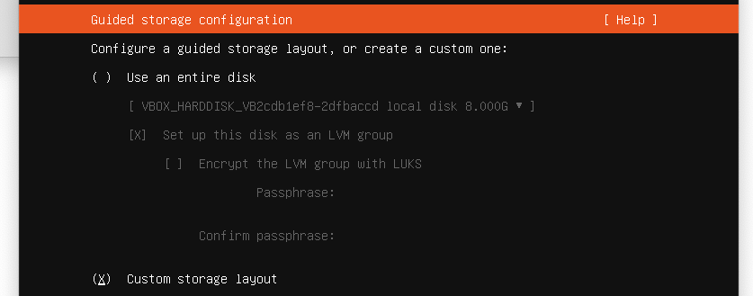

First thing is to **select our disk**:

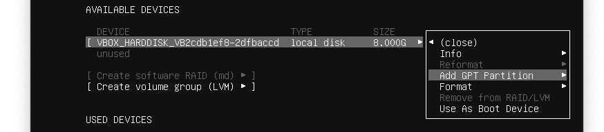

Then create the first partition, with a size of **4.2 GB**:

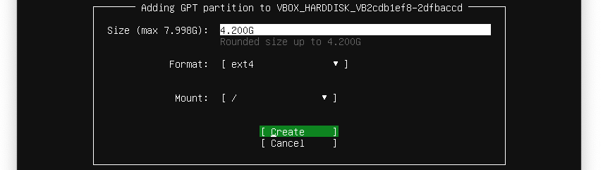

Note how a small **boot partition** with a size of **1 MB** is automatically added by the installer (otherwise we wouldn't be able of booting our system):


Now let's use the remaining space in disk to create a second partition. For that we have to select the disk again, and press enter on `Add GPT Partition`:

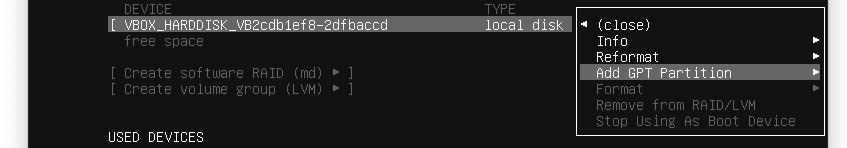

In the next screen we enter the size (all the remaining space) and where do we want to `mount` this partition; we'll mount it at `/home`.

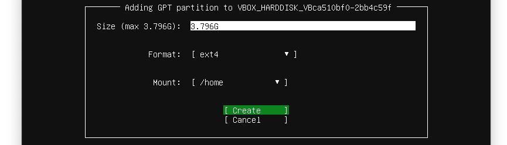

Finally, we'll be shown a **summary** of the partitions we want to create:

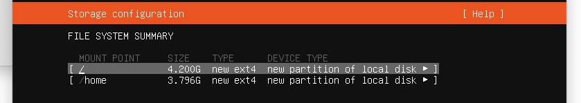

And we have to confirm the changes before they can be written to disk:

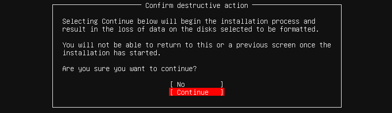

### User Profile
Now it's time to enter our **user information**:

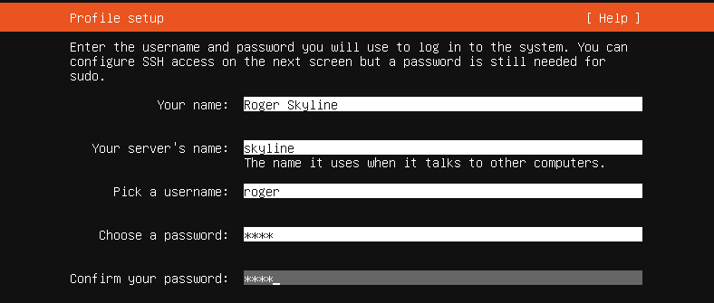

### SSH Setup
Since we're dealing with a server, setting up the SSH connection in important:

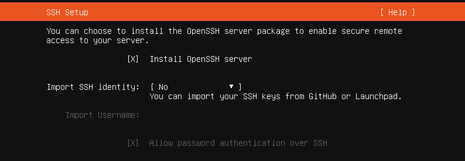

### Popular Snaps
Almost at the end comes this screen that gives us the option of installing popular packages used in servers:

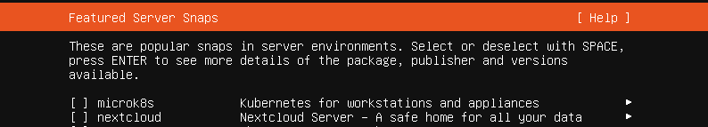

### Install Complete
Finally, the screen that lets us know that the **installation is complete**:


### Important: remove installation media
A really important step is to **remove** the Ubuntu Server ISO from the virtual CD, otherwise the installation process will start over again and again.

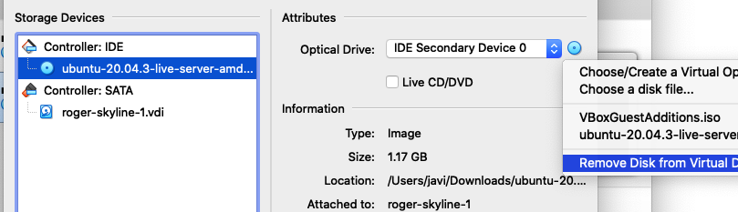

### Remove `cloud-init`
One thing we notice once we start Ubuntu Server, are the messages from [cloud-init](https://cloud-init.io/), which is a package that contains utilities for early initialization of cloud instances. Since we're not planning on launching our server in a cloud environment such as AWS, we can safely remove it:

1. Create an **empty file** to prevent the service from starting:
```
sudo touch /etc/cloud/cloud-init.disabled
```

2. **Disable** all services (uncheck everything except "None"):
```
sudo dpkg-reconfigure cloud-init
```

3. **Uninstall** the package and delete the folders
```
sudo dpkg-reconfigure cloud-init
sudo apt-get purge cloud-init
sudo rm -rf /etc/cloud/ && sudo rm -rf /var/lib/cloud/
```

4. **Restart** the machine: `sudo reboot`

---
[:arrow_backward:][back] ║ [:house:][home] ║ [:arrow_forward:][next]

<!-- navigation -->
[home]: ../README.md
[back]: ./creating_vm.md
[next]: ./static_ip.md
