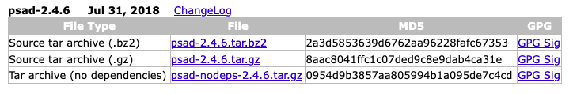

# Set a protection against Port Scans: Psad
One of the assignments is to set up a protection against scans on your VM’s open ports. For this purpose we'll use a tool named [Port Scan Attack Detection] (http://www.cipherdyne.org/psad/) (PSAD for short), which, as the name indicates, is used to block port scanning on servers.

**PSAD** continuously monitors firewall logs ([iptables](https://en.wikipedia.org/wiki/Iptables) in case of  the linux platform) to detect **port scan** or any other suspicious traffic. In case of successful attack on the server, PSAD also takes action to deter the threat.

## Scanning Ports
In order to test **PSAD** we'll use [Nmap](https://nmap.org/), a well-known tool mostly used for launching port scan to detect open/close ports. Let's install it:
```
sudo apt update && sudo apt install nmap
```

> If you're in a mac you could use `brew update && brew install nmap`.

We're ready to go. Let's **scan** the IP of our server to see what's open:
```
nmap -PN -sS 192.168.56.2
```

## Installing PSAD
To install it:
```
sudo apt update && sudo apt install psad
```

## Configuration
Once `psad` is installed, we must do two types of configuration:

* Configure [iptables](https://en.wikipedia.org/wiki/Iptables) for `psad`.
* Configure `psad` itself.

### Iptables Configuration
Before configuring `psad`, we need to configure `iptables` so that any malicious activity on the system will be registered in the logs. We can enable logging of packets with the following commands:
```
iptables -A INPUT -j LOG
iptables -A FORWARD -j LOG
```

After enabling **logging**, let's list the current configuration of iptables:
```
sudo iptables -L
```

The output of that command should reflect that we'll be logging ``all`` activity in the `INPUT`, `FORWARD`, and `OUTPUT` chains.

### Psad Configuration
We can find the `psad` configuration file under the `/etc/psad` directory. The main configuration file is named `psad.conf` as follows:
```
# Our hostname
HOSTNAME				skyline

# Change syslog file (by default, psad search for logs in /var/log/messages)
IPT_SYSLOG_FILE			/var/log/syslog

# Enable PSAD to manage firewall rules
ENABLE_AUTO_IDS			Y

# Enable iptables blocking
IPTABLES_BLOCK_METHOD	Y

# Disable email notifications
ALERTING_METHODS		noemail
```

Now we have to edit one more file in `/etc/psad/auto_dl` and the following line:
```
127.0.0.0/8      0
```

Then update the signatures database so that it can correctly recognize known attack types:
```
sudo psad --sig-update
```

> The **signature update** requires to be connected to the internet.

And **restart** the `psad` service:
```
sudo systemctl restart psad
```

We can check the current status of `psad` **detected events** with the following command:
```
psad -S
```

> To **remove blocked IPs**** run `sudo psad -F`.

Problem was that even though machines that were scanning my server were being reported, I couldn't manage to block their IPs.

### Psadwatch issue
Every time I tried to **reload** `psad`, was getting the error:
```
$ sudo psad -R
[-] psad: pid file /var/run/psad/psadwatchd.pid does not exist for psadwatchd on skyline
```

So I created a systemd unit-file for `psadwatch`, and tried to enable it, but to no avail:
```
sudo systemctl start psadwatchd.service 
sudo systemctl enable psadwatchd.service 
```

Then I realized that I had installed **Version 2.4.3** (from 2015), and that the latest version was **2.4.5** (from 2018). That led me to the conclusion (in 2022) that `psad` was abandonware.




### Uninstall Psad
To remove psad, along with its configuration, data and all of its dependencies, we can use the following command:
```
sudo apt-get -y autoremove --purge psad
```

> As an `apt-get` refresher: **remove** deletes the program, `autoremove` gets rid also of the dependencies, and `--purge- takes care of the configuration and data.

---
<!-- navigation links -->
[:arrow_backward:][back] ║ [:house:][home] ║ [:arrow_forward:][next]

[home]: ../README.md
[back]: ./port_scans_protection.md
[next]: ./stop_needless_services.md