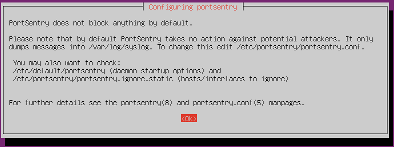

# Set a protection against Port Scans: Portsentry
One of the assignments is to set up a protection against scans on your VM’s open ports. For this purpose we'll use a tool named [Port Sentry] (https://sourceforge.net/projects/sentrytools/), whose only available reference was an old sourceforge link.

**Portsentry** is a program that tries to detect **portscans** on network interfaces with the ability to detect stealth scans. On alarm portsentry can block the scanning machine via:

* `hosts.deny` (see hosts_access(5)).
* Firewall rule (see ipfwadm(8), ipchains(8) and iptables(8)).
* Dropped route (see route(8)).

## Installing Portsentry
To install it:
```
sudo apt update && sudo apt install portsentry
```

During installation, `dpkg` showed us the following screen:



Which means that we'll have to add some configuration in order to get the IPs from attackers **blocked**.

## Configuration
Before start configuring we need to **stop** the **service**:
```
ssh roger@192.168.56.2 -p 69
service portsentry status
service portsentry stop
```

### Setting Advance Mode
From its `man` page, we learn that PortSentry has a bunch of **config files**, most of them under the `/etc/portsentry` folder, but the one that contains the **startup options** lives in `/etc/default/portsentry`. There we must select the **advanced** modes for both `TCP` and `UDP`, by prepending an `a` to the existing modes; this is the final result:
```
TCP_MODE="atcp"
UDP_MODE="audp"
```

> The settings above are equivalent to run `portsentry` with the `-atcp` and `-audp` options. If we use these options we'll see how `portsentry` is started with **Advanced stealth scan detection**.

### Block IPs
Apart from detecting scans, we also want to **block** the IPs of attackers. In order to do that, we have to edit the `/etc/portsentry/portsentry.conf` file and make sure that the settings for **blocking** UDP/TCP scans, are set to `1`:
```
BLOCK_UDP="1"
BLOCK_TCP="1"
```

There are several methods to **block** the IP, and since we're using Linux, we'll use [iptables](https://en.wikipedia.org/wiki/Iptables), which means we have to **comment out** all the `KILL_ROUTE` options, except the one that uses `iptables`:
```
KILL_ROUTE="/sbin/iptables -I INPUT -s $TARGET$ -j DROP"
```

Since there are a lot of options for `KILL_ROUTE`, we could double-check we set up the right one with:
```
$ cat /etc/portsentry/portsentry.conf | grep KILL_ROUTE | grep -v "#"
```

Once the changes have been saved, we're ready to **relaunch** the `portsentry` service:
```
service portsentry start
```

### Unblocking IPs
Now, if we try to run some **portscan**:
```
sudo nmap -PN -sS 192.168.56.2
```

> You may want to disable the firewall in order to test the **blocking IP** behaviour.

We may end up getting our IPs blocked, hence losing `ssh` access to our server. We can access the **virtual machine**, and check the files:
```
/var/lib/portsentry/portsentry.blocked.atcp
/var/lib/portsentry/portsentry.blocked.audp
```

> If you've gotten your *attacker* IP blocked, and can't `ssh` into your server, delete the offending IP from the `/etc/hosts.deny` file. Also check the `/var/lib/portsentry/portsentry.blocked` which contains **blocked hosts** and it's cleared up upon reload.

A good idea, if we plan on keep doing portscan experimentation, would be to add our *attacker* IP to one of the files:
```
/etc/portsentry/portsentry.ignore
/etc/portsentry/portsentry.ignore.static
```

Finally, to get ourselves **unblocked**:
```
sudo iptables -D INPUT -s 123.45.6.7 -j DROP
```

And also delete the IP at the end of `/etc/hosts.deny`, and restart `portsentry`.
---
<!-- navigation links -->
[:arrow_backward:][back] ║ [:house:][home] ║ [:arrow_forward:][next]

[home]: ../README.md
[back]: ./port_scans_protection.md
[next]: ./stop_needless_services.md