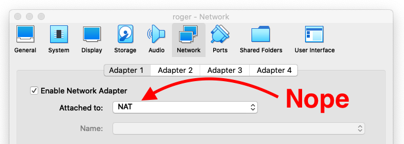
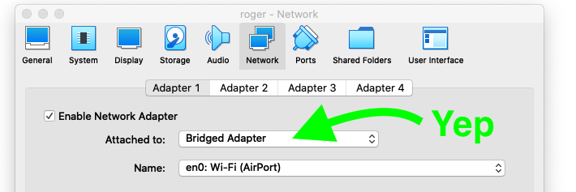
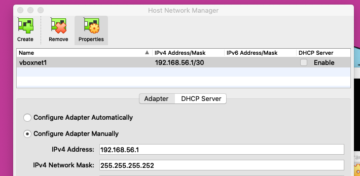
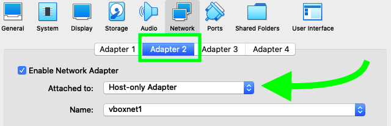

# Static IP
The assignment forbids us to use the [DHCP](https://en.wikipedia.org/wiki/Dynamic_Host_Configuration_Protocol) service of our machine. Instead we gotta configure it to have a **static IP** and a **Netmask** in `\30`.

## 1. Bridge Adapter
In our `init` project we were using the default adapter set to [NAT](). Doing that, we lose connectivity between the **host** and the **guest** (we can't `ssh` to our virtual machine). In order to connect to our **virtual machine** from our mac **host**, we had to add a **Port Forwarding Rule** (clicking in `Advance > Port Forwarding`).

> Using **DHCP** in our virtual machine, was forbidden in this project.

The first thing we have to do is open the VirtualBox **settings** and go to the **Network** tab. Once there, we have to change the **NAT** setting to **Bridge Adapter**.





> Note how the name of the interface also changed to the one we use to connect to the internet, in my case `en0`.

### Virtual Machine Configuration
Ubuntu uses a utility named [netplan](https://netplan.io/) to easily configure the network on a linux system. First thing we have to do is to identify the name of our interface:
```
ip a
```
In my case it was named `enp0s3`. We also needed to find out our:

* IP address:  172.18.3.98
* Gateway IP:  172.18.0.1
* Subnet mask: 255.255.252.0

To configure your system to use a **static IP address**, we have to create a netplan configuration in some YAML file, under the `/etc/netplan/`. In my case there was one named `00-installer-config.yaml`, so I created another one with `sudo edit `/etc/netplan/01-static-ip.yaml` and proceeded to add the following configuration in it:
```yaml
network:
   version: 2
   ethernets:
      enp0s3:
         addresses: [172.18.3.99/30]
         gateway4: 172.18.0.1
         nameservers:
           addresses: [172.18.0.1]
         dhcp4: no
```

You simply create a YAML description of the required network interfaces and what each should be configured to do. From this description Netplan will generate all the necessary configuration for your chosen renderer tool.

> Don't forget to `sudo netplan apply` after modifying the file.

With this configuration, we get both **internet connection** and the possibility to connect to our **guest** through a **static IP**. The problem was that I couldn't make it work **home**, since my laptop only had a **WiFi** card, and that seemed to be an issue.

> The Wi-Fi spec does not allow Bridging, but some Wi-Fi adapter drivers and/or access point firmware don't implement the spec strictly, so Bridged can squeeze through (check this [link](https://forums.virtualbox.org/viewtopic.php?f=35&t=96608#p468775)).

## 2. NAT + Host-Only Adapter
This was another approach that allowed me to have both a **static IP** and **internet connection** at the same time. I just had to **enable** two network adapters in the **virtual machine**:

* **Adapter 1**: set to **NAT**.
* **Adapter 2**: set to **Host-only Adapter**.

The **Host-only Adapter** must be created before it can be used. In order to do that, click on `File > Host Network Manager` (from the **VirtualBox** toolbar), and once there add the Host-only adapter:



Then, in our virtual machine, we would have to enable **Adapter 2** so it makes use of the available **Host-only Adapter**.



The configuration in the **virtual machine** was quite similar, but commenting out the `Gateway4` line was the trick that allowed the **guest** to access the internet:
```yaml
network:
   ethernets:
      enp0s3:
         addresses: [192.168.56.2/30]
         #gateway4: 192.168.56.1
         nameservers:
           addresses: [192.168.56.1]
         dhcp4: no
      enp0s8:
         dhcp4: yes
   version: 2
```

> Don't forget to comment out the `gateway4` line!

---
<!-- navigation links -->
[:arrow_backward:][back] ║ [:house:][home] ║ [:arrow_forward:][next]

[home]: ../README.md
[back]: ../README.md
[next]: ./ssh.md