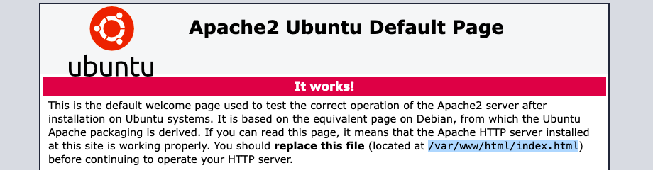

# Setting Up a Web Server
For the web server we used [Apache](https://httpd.apache.org/) because there's plenty of information on internet about how to set it up. First step, **installation**:
```
sudo apt update && sudo apt install apache2
```

## Opening the Firewall
During installation, Apache creates an *application profile* for [UFW](https://en.wikipedia.org/wiki/Uncomplicated_Firewall), that can be used to enable or disable access. Let's check the profile is there:
```
sudo ufw app list
Available applications:
  Apache
  Apache Full
  Apache Secure
```

We have three profiles available for Apache:

* `Apache`: This profile opens only **port 80** (normal, unencrypted web traffic)
* `Apache Full`: This profile opens both **port 80** (normal, unencrypted web traffic) and **port 443** (TLS/SSL encrypted traffic)
* `Apache Secure`: This profile opens only **port 443** (TLS/SSL encrypted traffic)

Since the assignment also asks for an [SSL Certificate](https://www.ssl.com/) later on, we'll choose `Apache Full`:
```
sudo ufw allow 'Apache Full'
```

Let's not forget to verify the change:
```
sudo ufw status
```

## Controlling the Web Server Service
At the end of the installation and configuration process, we're ready to **start** the server, but let's check its **status** first:
```
service apache2
Usage: apache2 {start|stop|graceful-stop|restart|reload|force-reload}
```

Or using `systemctl`:
```
sudo systemctl status apache2
```

This second command should show us that the service is **loaded** (the installation does that for us). Let's start it, if that's not the case:
```
sudo systemctl start apache2
```

To test the server, we could pull up a werb browser in our host machine, and point it to the **static IP** of the **virtual machine**. That should open a site that looks more or less like the screenshot below.



That's the **default welcome page** used to test the server.

## Default Document root
The page we we're just talking about is located under the `/var/www/html/` folder of our **virtual machine**. That's known as the **default Ubuntu document root**. By default, Ubuntu does not allow access through the web browser to any file apart of those located in:

* `/var/www/html/`
* `/usr/share` (for web applications).

> If your site is using a web document root located elsewhere we may need to **whitelist** that document root directory in `/etc/apache2/apache2.conf`.

To test that out, we could replace it with our own `index.html` file, which we can copy to the server using `scp`:
```
scp index.html rick_morty.jpg roger@192.168.56.2:/var/www/html/ -p 69
```

We may find **permissions** issue when trying to copy the files to `/var/www/`; that can be solved setting our user as owner of the folder and its contents:
```
ssh roger@192.168.56.2 -p 69
sudo mkdir /var/www/evil
sudo chown -R $(whoami) /var/www/evil
```

While we were at it, we also created a folder for our site, stay tuned!

## Virtual Hosts File
Apache can have **multiple sites** running on the same server by editing its **Virtual Hosts file**. We can make our own **virtual hosts** under `/var/www`. 

> As we mentioned before, `/var/www/html/` is the **default document root**. Like all sites in Apache, this site (the welcome page) is configured by a **VirtualHost file**. 

We can modify how handles incoming requests for a given site, by editing its **virtual hosts file**. There are two important folders in this regard:

* `/etc/apache2/sites-available/`, where we add our **configuration files** for each site.
* `/etc/apache2/sites-enabled/`, where we create **symbolic links** to the files in the folder mentioned above. Only the symlinks in this folder will be served by Apache.

Let's create a copy of the **virtual hosts file** of the welcome page, so that we can use as a base to configure our site. We'll use the occasion to show how to download files from the **server** to our **localhost** using `scp`:
```
scp -P 69 roger@192.168.56.2:/etc/apache2/sites-available/000-default.conf ./
```

> Syntax: scp <remote_user@remote_server:/path/to/file> <destination_in_localhost>

Once we have modified the **default virtual hosts file** to our heart's content, we can save it with another file, and upload it to the server:
```
scp -P 69 evil.conf roger@192.168.56.2:/home/roger
```

Once the configuration is up, we must move it to the right folder, and **enable** it with:
```
sudo mv evil.conf /etc/apache2/sites-available/
cd /etc/apache2/sites-available/
sudo a2ensite evil.conf
```

That must create a link in `/var/www/sites-enabled/`. Then we have to **restart** the server:
```
sudo systemctl restart apache2
```

> I had some trouble in the **host machine** accessing the site, once I had set up a **ServerName** for the site; after editing the `/etc/hosts` on the **host** to bypass the DNS (`192.168.56.2 evil.morty`), the browser still couldn't open the site.

By the way, this is what the site looked like:


## Set a SSL Certificate
Configuring an [SSL](https://en.wikipedia.org/wiki/Transport_Layer_Security) (Secure Sockets Layer) connection, allows you to add an additional asymmetric encryption protocol to the common HTTP. To establish a secure connection, Apache will need an **SSL certificate** that can be obtained from a **Certification Authority**. For convenience, in this example we will use a **self-signed certificate**, used only in test and development environments.

## The Snakeoil Certificate
When the package `ssl-cert` is installed, a **self-signed certificate** gets automatically created. It includes:

* The **certificate**, in `/etc/ssl/certs/ssl-cert-snakeoil.pem`
* The **private key** in `/etc/ssl/private/ssl-cert-snakeoil.key`

In order to add this certificate to our Apache web server, we have to make sure that the ssl mode is enabled: 
```
sudo a2enmod ssl
```

Then we have to modify the **virtual hosts file** of our site, adding a configuration for [HTTPS](https://en.wikipedia.org/wiki/HTTPS):
```
<VirtualHost *:443>
        ServerName evil.morty
        ServerAdmin roger@skyline
        DocumentRoot /var/www/evil/
        SSLEngine On
        SSLCertificateFile /etc/ssl/certs/ssl-cert-snakeoil.pem
        SSLCertificateKeyFile /etc/ssl/private/ssl-cert-snakeoil.key
        ErrorLog ${APACHE_LOG_DIR}/error.log
        CustomLog ${APACHE_LOG_DIR}/access.log combined
</VirtualHost>
```

Then **reload** the service to activate the new configuration:
```
sudo systemctl restart apache2
```

Because the certificate we created isn’t signed by one of our browser’s trusted **certificate authorities**, we will shown a warning about our connection not being private. Click **ADVANCED** and then the link provided to proceed to our host anyways.

We may also need to add a `Redirect` directive to our `<VirtualHost *:80>` configuration:
```
Redirect / https://evil.morty
```

### Regenerating Snakeoil
If for some reason you can't find the files mentioned above, they can be regenerated manually with the following command:
```
sudo make-ssl-cert generate-default-snakeoil --force-overwrite
```

Even if you have the files, regenerating them may be useful in certain cases; for example, we might find that the snakeoil certificate on our system is actually quite old. That's because is is not regenerated every time the package gets upgraded so at some point will be outdated.

### Creating our own Certificate
Create an **SSL certificate** takes two steps:

* Create a **private key**.
* Create the **public certificate** based on the **private key**.

Both steps can be accomplished in a single line:
```
sudo openssl req -x509 -nodes -days 365 -newkey rsa:2048 /
-keyout /etc/ssl/private/apache-selfsigned.key /
-out /etc/ssl/certs/apache-selfsigned.crt
```

The meaning of the **options** used:

* `req`, is for *requesting* a [Certificate Signing Request](https://en.wikipedia.org/wiki/Certificate_signing_request).
* `-x509`, creates a [X.509 Certificate](https://en.wikipedia.org/wiki/X.509).
* `-days 365` the time validity of the certificate.
* `-keyout /etc/ssl/private/apache-selfsigned.key`, where do we want the **private key**.
* `-out /etc/ssl/certs/apache-selfsigned.crt`, where do we want the **public certificate**.


---
<!-- navigation links -->
[:arrow_backward:][back] ║ [:house:][home] ║ [:arrow_forward:][next]

[home]: ../README.md
[back]: ./monitor_crontab.md
[next]: ./deployment.md